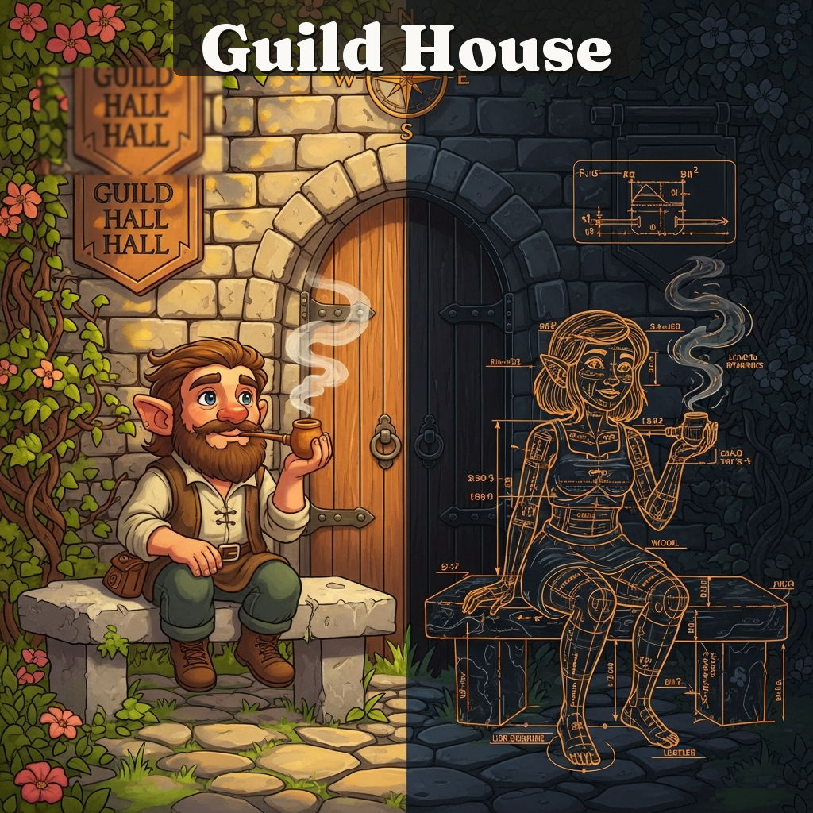

  

  <em>"The best retrieval system isn't the one with the best answer. It's the one that knows which system should answer each question."</em>

---

# GuildHouse

A hybrid retrieval architecture for AI memory systems.

GuildHouse is a routing layer that sits between your AI assistant and multiple memory backends -- knowledge graphs, vector stores, file-based memory -- and dispatches each query to the system best suited to answer it. The result: better answers at lower cost than any single system achieves alone.

In practice, it's a set of conventions for organizing markdown-based memory files with YAML frontmatter, a query routing table derived from real benchmarks, and patterns for keeping knowledge healthy over time. No database, no framework -- just structured files and the intelligence to know which system should answer each question.

## What You Need

GuildHouse is a pattern. The core tier (file-based working memory) needs nothing but a filesystem. The full architecture adds two more systems:

| Tier | What | Required? | Options |
|------|------|-----------|---------|
| **Workbench** | Markdown files with YAML frontmatter | Yes (the foundation) | Any AI coding assistant with file-based memory. Built on [Claude Code](https://docs.anthropic.com/en/docs/claude-code)'s auto-memory system. |
| **Semantic Search** | Vector store over your documents | Recommended | [QMD](https://github.com/tobilu/qmd), Obsidian + Smart Connections, any embedding pipeline |
| **Knowledge Graph** | Structured facts with temporal validity | Optional (adds precision) | [MemPalace](https://github.com/milla-jovovich/mempalace/tree/main), or any structured store (SQLite, Neo4j, even a JSON file with typed triples) |
| **Router** | Query classification + dispatch logic | The whole point | Start with the 5-rule table below. Customize through benchmarks. |

You can start with just the first tier and add the others as you feel the pain they solve. See [Architecture](reference/architecture.md) for the incremental build path.

## The Problem

Every memory system has a blind spot.

Knowledge graphs are precise and temporal -- they can tell you exactly when a fact became true and when it expired. But ask one "tell me the story of how this project evolved" and you'll get a pile of disconnected triples. Vector stores excel at narrative and semantic similarity, but they can't answer "what changed between March and April?" without retrieving half the corpus and hoping. File-based memory (the kind most AI coding assistants use) is fast and current, but shallow -- good for "what happened today," terrible for "what happened six months ago."

No single system handles all the shapes that recall takes. And bolting them together without routing intelligence just means you pay the cost of all three while getting the worst latency of whichever one struggles most with your query.

The problem isn't that we lack good memory systems. It's that we lack a good way to choose between them.

## The Philosophy

GuildHouse is not "one memory to rule them all." That instinct -- unify everything into a single store -- is the instinct that keeps failing.

Memory is a routing problem. Different questions have different shapes, and different systems have different strengths. A temporal fact lookup and a narrative context retrieval are fundamentally different operations. Sending both to the same system is like using a screwdriver for every fastener in the shop.

GuildHouse emerged from daily use, not theoretical design. It started as a competitor in head-to-head benchmarks against a knowledge graph and a vector store. It was supposed to prove that a hybrid approach could beat the specialists. Instead, it proved something more useful: the value isn't in building a better system. It's in building a better router.

The key insight: routing intelligence matters more than individual system quality. A mediocre vector store with good routing outperforms an excellent vector store answering every query. Twenty-four races didn't produce a winner. They produced a routing table.

## The Architecture

GuildHouse routes queries across three tiers, each with a distinct role and character.

### MemPalace (Knowledge Graph)

Structured facts, temporal queries, cold and precise.

MemPalace is the filing cabinet that knows exactly when facts became true and when they expired. It stores triples -- entity, predicate, object -- with date ranges. Ask it "what was the project status on March 15?" and it gives you the answer that was valid on that date, not the answer that's valid now.

Best for: exact facts, temporal queries, entity lookups, relationship verification.
Worst for: narrative, context, "tell me about..."

### Workbench (Working Memory)

Feedback, project state, session outcomes, patterns. Warm and lived-in.

This is the workbench where craft knowledge accumulates. Session checkpoints, user corrections, design decisions, tool workarounds, things that were tried and failed. It's file-based and grep-friendly -- not sophisticated, but fast and current. The kind of memory that makes an AI assistant feel like it was paying attention yesterday.

Best for: recent activity, project state, accumulated preferences.
Worst for: deep history, cross-project patterns, semantic similarity.

### Semantic Search (Vector Store)

Deep. Finds meaning, not just keywords.

This is your vector document store -- documents chunked, embedded, and searchable by meaning. Ask "how did the architecture evolve?" and it finds relevant passages even if they never use the word "architecture." Any embedding pipeline works: QMD, Obsidian with Smart Connections, or a custom solution.

Best for: conceptual questions, narrative history, cross-document synthesis.
Worst for: exact facts, temporal precision, "what changed between X and Y?"

## The Routing Table

The production router uses five rules based on query shape. Each rule maps to the retrieval system (or combination) best suited for that shape.

| Query Shape | Route | ~Token Cost | Example |
|---|---|---|---|
| Exact fact (date, status, price) | KG with predicate filter | 15-67 | "When was the product renamed?" |
| Broad entity ("What is X?") | KG + vector search in parallel | ~1,875 | "What is Project Alpha?" |
| Narrative (history, context) | Vector search only | ~750 | "Tell me about the design evolution" |
| Relationship (who, what connects) | Vector search --> KG backfill | ~1,200 | "Who are the active clients?" |
| Recent activity | File memory --> vector search | ~1,100 | "What happened this week?" |

### Fast-Path Rules

Not every query needs the full routing logic:

- **KG returns exact fact with relevance >= 0.95** --> stop. Don't query other systems. The filing cabinet had the answer.
- **Vector search scores 0.90+ and KG returns nothing** --> use the vector result directly. Don't refine. The semantic match is strong enough.

These fast paths handle roughly 40% of real-world queries and keep average retrieval cost well below what any single system would spend answering everything.

### How the Classifier Works

There is no separate classification model or code. The routing table goes into your AI assistant's project instructions (e.g., `CLAUDE.md` for Claude Code), and the assistant itself pattern-matches each query against the five shapes.

When a user asks "When was the API key rotated?", the assistant reads the query, recognizes "when was X" as an exact-fact shape, and routes to the structured store with a predicate filter. When they ask "How did we end up with this architecture?", it recognizes the narrative shape and routes to semantic search only.

**The prompt IS the classifier.** The five shapes are stable enough that natural language pattern-matching works -- you don't need a trained model to distinguish "When was X renamed?" from "Tell me the history of X." The routing table in your project instructions is the implementation.

This means:
- **Setup cost is near zero** -- paste the routing table into your project instructions
- **Customization is editing text** -- add a 6th rule, adjust thresholds, change the wording
- **No inference overhead** -- classification happens as part of the assistant's normal reasoning, not as a separate step
- **It works across AI assistants** -- any assistant that reads project instructions can use the same routing table

## The Evidence

The routing table wasn't designed on a whiteboard. It was derived from 24 benchmark races across 5 seasons -- an internal competition we called "The Guild Prix." Each race pitted four systems against each other on real queries from daily use: the knowledge graph alone, the vector store alone, file-based memory alone, and the hybrid router.

### Key Results

- **19 of 24 quality championships** won by the hybrid router
- **97.2% token reduction** on targeted queries via KG predicate filtering (2,400 --> 67 tokens)
- **+0.35 relevance improvement** on temporal queries via routing optimization
- The router's optimizations improved the other systems, not just itself -- KG predicate filters and vector search refinements discovered during routing were fed back to the individual systems

### The Racer Became the Router

The most interesting result wasn't a number. It was a role change.

The hybrid started as a competitor -- another system trying to win races. But by Season 3, the pattern was clear: the hybrid's advantage wasn't better retrieval. It was better dispatch. It won by knowing which system to call, not by being better at calling.

So the hybrid stopped competing and started orchestrating. It became the routing layer, and the other systems got better because of it.

As one season summary put it: *"GuildHouse gives the best answer. The vector store wins the championship. That is not a contradiction."* The router makes every system perform at its ceiling.

## Getting Started

GuildHouse is a pattern, not a monolith. You can adopt the routing table with whatever backends you already use, or start with the reference implementation.

- **[Quick Start: Single Project](guides/getting-started.md)** -- Set up GuildHouse for one project in under 30 minutes
- **[Scaling Across Projects](guides/multi-project.md)** -- Share memory tiers across multiple repos and contexts
- **[AI Implementation Playbook](guides/ai-implementation.md)** -- Hand this to your AI assistant. Seriously. It's written for them.
- **[Post-Setup Checklist](guides/post-setup-checklist.md)** -- Verify everything is working after setup

## Reference

- **[The Routing Table](reference/routing-table.md)** -- Full routing rules with decision logic and edge cases
- **[Drag Race Methodology](reference/drag-race-methodology.md)** -- How to benchmark your own retrieval systems head-to-head
- **[Architecture Deep Dive](reference/architecture.md)** -- System design, data flow, and integration points

## Going Deeper

After the basics are working, these patterns take the system further:

- **[Automation & Hooks](guides/automation.md)** — Session lifecycle, the prepare→index→embed pipeline, and scheduled maintenance
- **[Advanced Patterns](reference/advanced-patterns.md)** — Knowledge gardening, checkpoints, prefetch, decision replay, staleness detection, and transactional knowledge

## How Is This Different from RAG?

RAG (Retrieval-Augmented Generation) retrieves from one store, then generates. GuildHouse is the layer *before* retrieval that decides which store to ask.

| | RAG | GuildHouse |
|---|---|---|
| **Core question** | "What's relevant to this query?" | "Which system should answer this query?" |
| **Architecture** | One retrieval system → one generation step | Multiple retrieval systems → router → best system(s) → generation |
| **Optimization** | Better embeddings, better chunking, better prompts | Better routing — knowing when NOT to call a system saves more than improving any single system |
| **Failure mode** | Wrong chunks retrieved → wrong answer | Wrong system queried → wrong answer shape (precise when you needed narrative, or verbose when you needed a single fact) |

GuildHouse isn't a replacement for RAG. It's a router that might send some queries to your RAG pipeline, some to a knowledge graph, and some to a fast file lookup -- depending on the query shape. You probably already have the retrieval systems. GuildHouse helps you use them better.

## FAQ

**Does this only work with Claude Code?**
The reference implementation and guides are written for Claude Code's auto-memory system (`~/.claude/projects/.../memory/`). But the pattern -- structured markdown files, YAML frontmatter, a routing table, health checks -- works with any AI assistant that can read files. Cursor, Windsurf, Copilot, or a custom setup would need different file paths and hook mechanisms, but the architecture is the same.

**What if I don't have a knowledge graph?**
Start without one. The file-based memory tier + semantic search covers most query shapes. Add a structured store when you keep asking "when did X change?" and can't find the answer. See [Architecture § What You Actually Need](reference/architecture.md) for the incremental build path.

**How much setup time does this take?**
The basic file-based memory tier takes 30 minutes (see [Getting Started](guides/getting-started.md)). Adding semantic search depends on your tool -- QMD indexes a directory of markdown in under a minute. A knowledge graph is the most investment, but it's optional. Most of the value comes from the first tier.

**Can I use this with a different vector store?**
Yes. The routing table describes query shapes and strategies, not specific tools. Swap QMD for Pinecone, Chroma, Weaviate, or anything that takes a text query and returns ranked results. The thresholds (0.95, 0.90) will need recalibration for your system.

**Is the router a piece of software I install?**
No. The router is a decision pattern -- five rules that classify queries by shape and pick the best retrieval path. You implement it however fits your setup: a bash script, a Claude Code hook, a prompt instruction, or just a mental checklist. The [Routing Table](reference/routing-table.md) documents the rules; the [Drag Race Methodology](reference/drag-race-methodology.md) shows how to derive your own.

## Limitations and Honest Caveats

The routing table was derived from one team's daily usage patterns -- a small consultancy doing strategy, software, and operations work. Your query distribution will be different. The five rules are a starting point, not a universal law.

The 24 races used a specific knowledge graph (MemPalace), a specific vector store (QMD), and Claude Code's auto-memory. Your backends will have different performance characteristics. The pattern generalizes; the specific thresholds (0.95 relevance, 0.90 vector score) need calibration for your setup.

This is a young project. The routing intelligence is rule-based, not learned. A future version might train the router on query-outcome pairs, but for now, the five rules work well enough that we haven't needed to.

## Attribution & Thanks

GuildHouse wouldn't exist without the systems it learned to route between:

- **[QMD](https://github.com/tobilu/qmd)** by Tobias Ludwig ([@tobilu](https://github.com/tobilu)) -- the vector document store that proved semantic search could be the backbone of AI memory. The hybrid router's best results came from knowing when to trust QMD completely.

- **[MemPalace](https://github.com/milla-jovovich/mempalace/tree/main)** -- the temporal knowledge graph that taught us structured facts need date ranges, not just values. The insight that "current status" and "status on March 15th" are different queries shaped the entire routing architecture.

- **[Claude Code](https://docs.anthropic.com/en/docs/claude-code)** by Anthropic -- the AI coding assistant whose auto-memory system became the warm middle layer. The simplest system in the stack, and often the fastest path to the right answer.

Built at **[Heartwood Guild](https://heartwoodguild.com)** by Patrick Rivenbark.

## License

[MIT](LICENSE)
